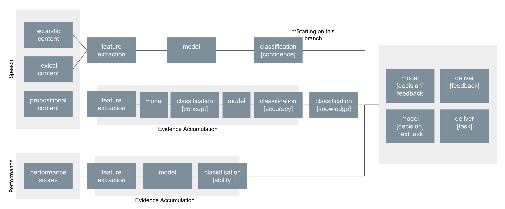

# RETTL UCI FIU

Automated robotics training in VR: Concept and Affect Detection.



## **Confidence Estimation**

### Requirements

Set up a Python development environment for this project using this [tutorial](https://cloud.google.com/python/docs/setup#macos). 

```shell
cd your-project
python -m venv env
source env/bin/activate
```

### Tasks

- [x]  Create file name convention.
- [x]  Write python code to segment recordings in 5s clips.
- [x]  Use google speech-to-text to transcript 5s clips and store transcriptions
- [x]  Save the transcription for each 5 seconds clips, with the same naming conventions. 
- [ ]  Password protected cloud-based storage to share with UCI, FIU, OS researchers.
- [ ]  Extract and store acoustic features of clips (OpenSmile library), with the same naming conventions. 
- [ ]  Concatenate student id, clip id, acoustic features, transcription content to a csv file. 

### Naming Convention

First directory: student id

Second directory: task id

Third directory: clip id number

For each clip: studentId-taskId-clipId. 

### Extract Features

Extract and store acoustic features: compare emotion, EGEmaps. 

Goal: find the features which are most correlated to the labeled confident extend.
